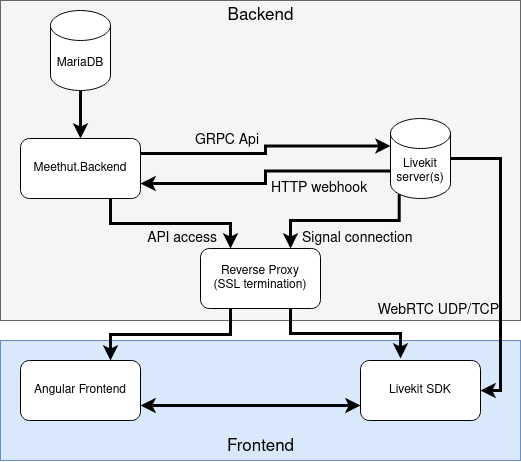

# Project structure

- `.` - Docker(-compose) related files, solution, basic configurations, scripts
- `./MeetHut.Backend` - AspNetCore main application
  - `./ClientApp` - Angular frontend app
  - `./Controllers` - ASP controllers
  - `./Middlewares` - Server level middlewares
- `./MeetHut.CommonTools` - Common functions
- `./MeetHut.DataAccess` - Database layer (EntityFramework)
  - `./Entities` - EF Entity classes
  - `./Enums` - EF Enum definitions
  - `./Migrations` - EF generated migrations, use helper command to generate
  - `./Repository` - EF repository class
- `./MeetHut.Services` - Services, Models
  - `./Application` - Application (Auth, User, ...) services, model definitions, mappers
  - `./Meet` - Meet (Room, Conference, ...) services, model definitions, mappers
- `./docs`
  - Documentation - Docsify

# Architecture

Currently supporting horizontal scaling of the `Meethut.Backend` is out of scope. It should mostly work (the api is stateless), but features like Chat can be broken.
